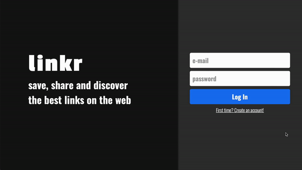

# LinkrFront

Design de um aplicativo de mídia social! Com direito a cadastro, login, comentar, curtir, postar, buscar usuários, filtrar por hashtags e muito mais!



Experimente agora [aqui](https://linkr-iota.vercel.app) <br/>
Confira o back-end também [aqui](https://github.com/taisoliva/linkrAPI)

## Sobre

Este é o front-end do aplicativo web full-stack Linkr! É responsivo e tem persistência de dados, fique à vontade para usar e abusar dele!

Abaixo estão os recursos implementados:

- Sign Up
- Login
- LogOut
- Pesquisar por user by name
- Filtar posts por hashtag
- Follow/Unfollow user
- Delete seu post
- Editar seu post
- Muito mais !
  
Ao usar este aplicativo qualquer usuário pode compartilhar um link na internet e comentar sobre ele!

## Technologies
As seguintes ferramentas e frameworks foram utilizados na construção do projeto, você encontra a lista completa no package.json:<br>
<p>
  
  
  
  
  
  
  
  
  
  
  
  
  
  
</p>

## Como rodar

1. Clone este repositorio 
2. Instale as dependências
```bash
npm i
```
3. Crie um arquivo .env na raiz do projeto com a seguinte variável nele
```bash
REACT_APP_API_URL=https://yourBackEndLink:PORT
```
4. Rode o front-end com
```bash
npm start
```
5. Opcionalmente, você pode construir o projeto em execução
```bash
npm run build
```
6. Por fim acesse http://localhost:3000 no seu navegador preferido (a menos que seja o Internet Explorer. Neste caso, reveja suas decisões de vida)
